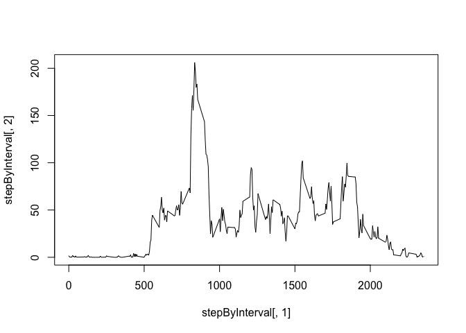
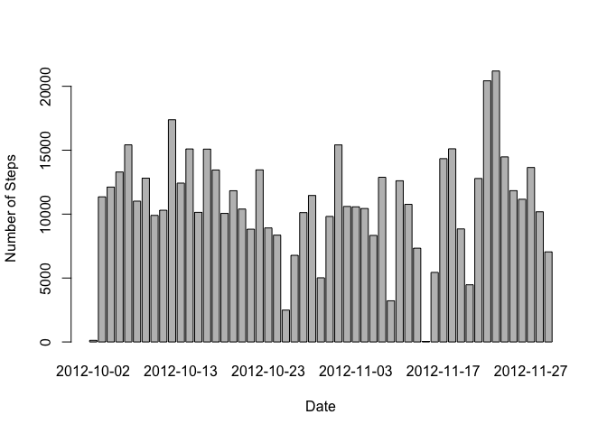

# Reproducible Research: Peer Assessment 1


## Loading and preprocessing the data

First we unzip the code and read the csv file into `df`. As the missing value of
df can be ignored, the df can be completed to complete df


```r
unzip("activity.zip")
df <- read.csv("activity.csv")
completedf <- df[complete.cases(df),]
head (completedf)
```

```
##     steps       date interval
## 289     0 2012-10-02        0
## 290     0 2012-10-02        5
## 291     0 2012-10-02       10
## 292     0 2012-10-02       15
## 293     0 2012-10-02       20
## 294     0 2012-10-02       25
```

```r
summary(completedf)
```

```
##      steps                date          interval     
##  Min.   :  0.00   2012-10-02:  288   Min.   :   0.0  
##  1st Qu.:  0.00   2012-10-03:  288   1st Qu.: 588.8  
##  Median :  0.00   2012-10-04:  288   Median :1177.5  
##  Mean   : 37.38   2012-10-05:  288   Mean   :1177.5  
##  3rd Qu.: 12.00   2012-10-06:  288   3rd Qu.:1766.2  
##  Max.   :806.00   2012-10-07:  288   Max.   :2355.0  
##                   (Other)   :13536
```

Then we can calculate the total of each day using `aggregate`
## What is mean total number of steps taken per day?


```r
stepByDate <- aggregate(steps ~ date, data = completedf, FUN = sum)
barplot(stepByDate$steps, xlab = "date", ylab = "steps", 
        names.arg = stepByDate$date)
```

<!-- -->

```r
dailymean <- aggregate(steps ~ date, data = completedf, FUN = mean)
dailymedian <- aggregate(steps ~date, data = completedf, FUN = median)
mmdaily <- merge(dailymean, dailymedian, by.x = "date", by.y = "date")

##stepstatis <- data.frame(c)
```

Mean total number of steps is 


```r
mean (stepByDate$steps)
```

```
## [1] 10766.19
```

Median total number of steps is 


```r
median (stepByDate$steps)
```

```
## [1] 10765
```
Make a time series plot (i.e. 𝚝𝚢𝚙𝚎 = "𝚕") of the 5-minute interval (x-axis
) and the average number of steps taken, averaged across all days (y-axis)


```r
stepByInterval <- aggregate(steps ~ interval, data = completedf, FUN = mean)
head (stepByInterval)
```

```
##   interval     steps
## 1        0 1.7169811
## 2        5 0.3396226
## 3       10 0.1320755
## 4       15 0.1509434
## 5       20 0.0754717
## 6       25 2.0943396
```

```r
plot (stepByInterval[,1], stepByInterval[,2], type = "l")
```

<!-- -->

Which 5-minute interval, on average across all the days in the dataset, 
contains the maximum number of steps?


```r
print (stepByInterval[which.max(stepByInterval$step),] )
```

```
##     interval    steps
## 104      835 206.1698
```


## inputing missin values
1. Calculate and report the total number of missing values in the dataset 
(i.e. the total number of rows with 𝙽𝙰s)


```r
sum (is.na(df$steps))
```

```
## [1] 2304
```

2. Devise a strategy for filling in all of the missing values in the dataset. 
The strategy does not need to be sophisticated. For example, you could use the
mean/median for that day, or the mean for that 5-minute interval, etc.
3. Create a new dataset that is equal to the original dataset but with 
the missing data filled in.

```r
stepByDate <- aggregate(steps ~ date, data = df, FUN=sum)
filledDF <- merge(df, stepByDate, by="date", suffixes=c("",".new"))
naSteps <- is.na(filledDF$steps)
filledDF$steps[naSteps] <- filledDF$steps.new[naSteps]
filledDF <- filledDF[,1:3]
```


4. Make a histogram of the total number of steps taken each day and Calculate 
and report the mean and median total number of steps taken per day.

```r
stepsByDate <- aggregate(steps ~ date, data=filledDF, FUN=sum)
barplot(stepsByDate$steps, names.arg=stepByDate$date, xlab="Date", 
        ylab="Number of Steps")
```

<!-- -->


Mean for the missin data filled in

```r
mean (stepsByDate$step)
```

```
## [1] 10766.19
```

Median for missin data filled in.

```r
median (stepsByDate$step)
```

```
## [1] 10765
```

They do not differ from the estimates from first part of the assignment

## Are there differences in activity patterns between weekdays and weekends?

1. Create a new factor variable in the dataset with two levels – “weekday” 
and “weekend” indicating whether a given date is a weekday or weekend day.


```r
WeekPart <- function(date) {
    if(weekdays(as.Date(date)) %in% c("Saturday", "Sunday")) {
        day <- "Weekend"
    } else {
        day <- "Weekday"
    }
}
filledDF$weekPart <- as.factor(sapply(filledDF$date, WeekPart))
```

2. Make a panel plot containing a time series plot (i.e. type = "l") of the
5-minute interval (x-axis) and the average number of steps taken, averaged 
across all weekday days or weekend days (y-axis).


```r
library(reshape2)

melted <- melt(filledDF, measure.vars="steps")

meanSteps <- dcast(melted, weekPart+interval~variable, mean)

library(lattice)

xyplot(steps~interval|weekPart,
    data=meanSteps,
    xlab="Interval",
    ylab="Number of steps",
    type="l",
    layout=c(1,2)
)
```

<!-- -->
